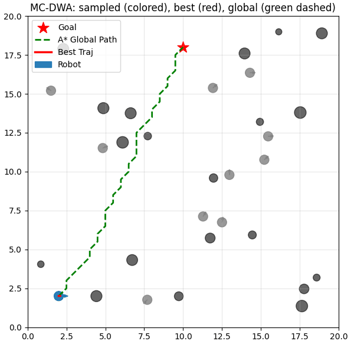
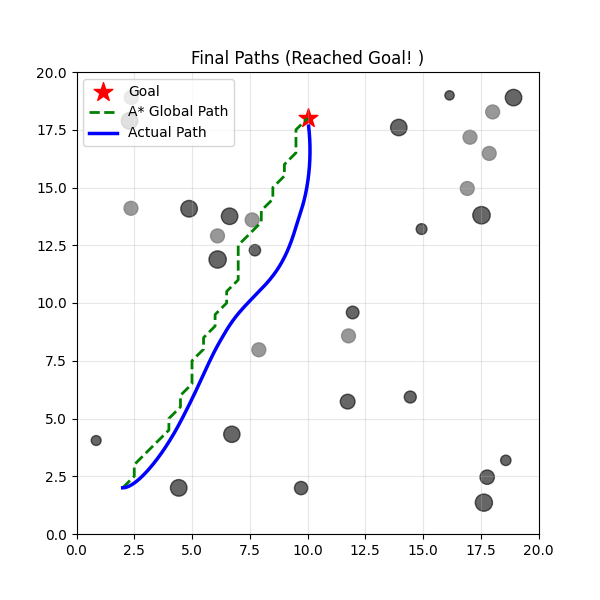

# :microphone: MC_DWA: Multi-Constraint Enhanced DWA for Robust and Smooth Local Navigation
This is the code for article "Multi-Constraint Enhanced DWA for Robust and Smooth Local Navigation"

**State:** 
- The expanded version is under review...
- Our conference version (with 4 pages) was accepted by [17th PRIP](https://prip.by/2025/)

---

The method enhances the trajectory evaluation by introducing several refined constraint metrics, such as
- dual-angle heading deviation；
- global path adherence；
- curvature variation control and jerk suppression. 

## Visualization 
Here we used Python(for better visualization) to deploy the algorithm onto a map containing dynamic obstacles.

  
  

